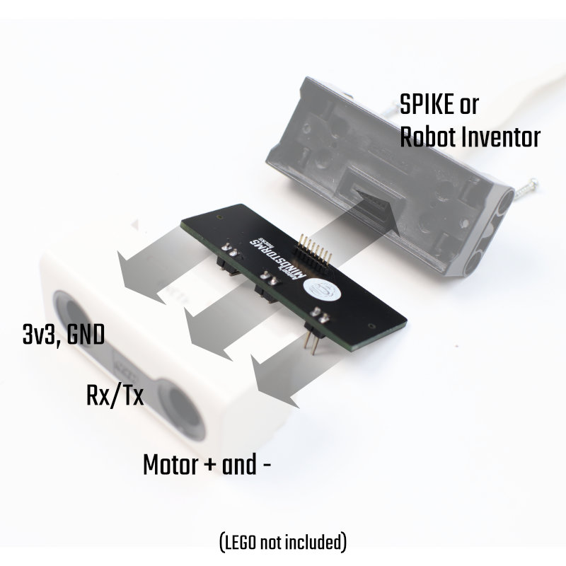
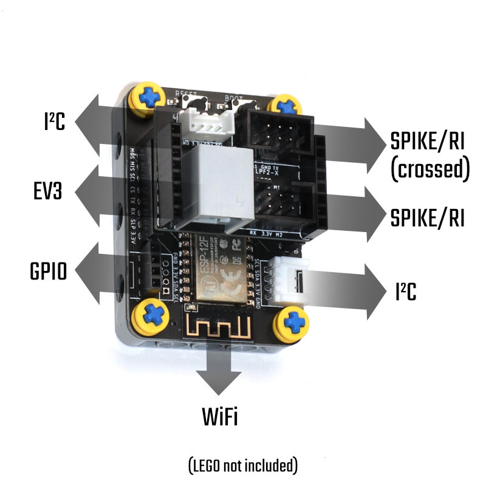

.. _hardware_docs:

Hardware documentation
======================

Hhere you will find documentation about the following hardware baords:

LMS-ESP32
---------

|Esp32 wifi board|

.. toctree::
   :maxdepth: 1

   LMS-ESP32/hardware.rst
   LMS-ESP32/Assembling-the-esp32-board.rst
   LMS-ESP32/Troubeshooting-your-LMS-ESP32-board.rst

OpemMV Uart Convertor board
---------------------------

|OpenMV breakout|

.. toctree::
   :maxdepth: 1

   OpenMV convertor board/Assembling-the-converter-board.rst

Distance Sensor Breakout board
-----------------------------

.. toctree::
   :maxdepth: 1
   Distance Sensor Breakout board/Assembling-the-distance-sensor-breakout.rst

LMS-ESP8266
-----------

|Esp8266 wifi board|

.. toctree::
   :maxdepth: 1

   LMS-ESP8266/Arduino-environment.rst
   LMS-ESP8266/Configure-webrepl.rst
   LMS-ESP8266/Connecting-via-webrepl.rst
   LMS-ESP8266/Flashing-the-ESP-boards.rst 

.. |Esp32 wifi board| image:: LMS-ESWP32/images/esp32-wifi.jpg
.. |OpenMV breakout| image:: OpenMV convertor board\images\

