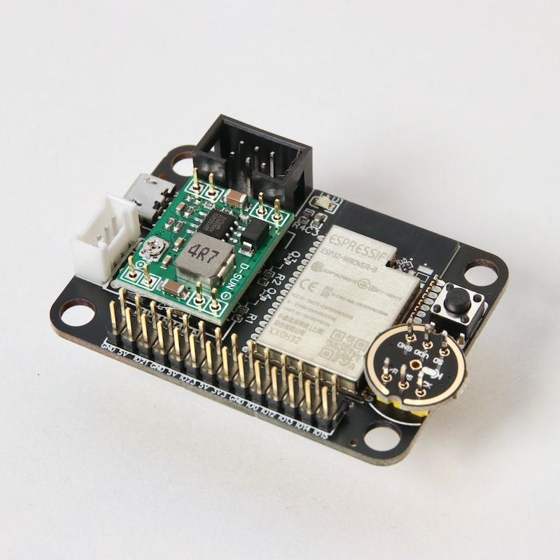

Assembling the ESP32-wifi board
===============================

Your bord comes flashed with the lasted micropython. It includes our
`boot.py <https://github.com/antonvh/flash-esp/blob/master/boot.py>`__
that creates a WiFi Access point called ESP-AP. The password is
``micropythoN``. When you're connected, you can use a
`WebREPL <Connecting-via-webrepl>`__ to program your board. Just press
enter when it asks for a password. There is none.

Just build it, like in the image below. Double check these:

-  The orientation of the Buck converter. The 4R7 on the side of the 16
   pin header.
-  The orientation of the microphone. The icon faces upward and points
   toward the board.
-  The orientation of the black 6 pin port. The small opening on the
   side should face inward.
-  The switch is optional. You can reset via usb or power-cycle.

IMPORTANT NOTE! In the picture below, I did not add solder because I was
in a hurry to get it photographed. To be clear: You DO need to solder
it.

|Esp32 wifi board|

