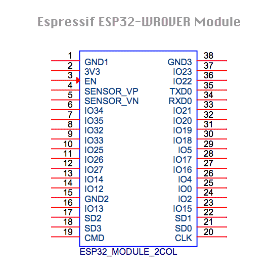

Check headers connections after soldering
-----------------------------------------

Tools needed:

-  a multi meter, preferable with an audible continuity check (it beeps
   when a short connection between the two probes is measured)

When soldering the headers it can happen that the header pin does not
make proper contact with the soldering pad. To check proper connections
you can use the pre flashed ``test_lms_esp32.py`` script. Prefrably do
this check before you solder the microphone and the buck convertor on
the board, otherwise access to some pins on the ESP32 may be blocked.

LEGO connection port
--------------------

-  start e REPL prompt and perform the following commands

::

   from test_lms_esp32 import *
   test_lego_port()

-  connect the RX and TX pin of the 3x2 lego header using a
   female-female jump cable as shown below and press ENTER.

.. raw:: html

    

This should result in the following output:

::

   [*] Connect RX and TX pins of LEGO port.
   [?] Press ENTER to start LEGO port check.
   [*] Lego port UART OK

If you do not see the output ``[*] Lego port UART OK``, check whether
the header pins are properly soldered on the board by checking the
connection between the RX pin on the header and GPIO18 on the ESP32 and
the TX pin and GPIO19 on the ESP32. See the diagram. If there is no
connection, reheat the solder pads on the LEGO connector with a
soldering iron.

I2C port
--------

-  Connect an i2c device to the Grove's port
-  start a REPL prompt and perform the following commands

::

   from test_lms_esp32 import *
   test_i2c_port()

This should result in an output similar to this:

::

   [*] Connect an I2C device to the Grove's port
   [?] Press enter
   [*] I2C device deteced with address: [95]

where the address displayed (in this case 95) should correspond to the
i2c address(es) of your i2c device.

GPIO header
-----------

Once you convinced yourself that the LEGO port is properly working we
will use the RX pin of the LEGO port to check connections of the GPIO
header and I2C Grove's header.

-  run the following code in a REPL prompt

::

   from test_lms_esp32 import *
   test_gpio_port()

you will see the following:

::

   [*] Connect the LEGO RX pin with one of the GPIO pins.
   [*] Disconnect I2C devices from Grove's port.
   [*] The corresponsing GPIO pin should be marked as [1].
   [?] Press enter to start.

-  connect the RX pin of the LEGO port with the GPIO pin you want to
   test. In the picture below we want to test e.g. GPIO15

.. raw:: html

    

-  press ENTER

The script will show every 0.5 seconds the state of the GPIO pins in the
following scheme:

::

   [*] -------------------------------------
   [*] GP05 GP22 GP25 GP02 GP26 GP27 GP32 GP33 
   [*]  [0]  [0]  [0]  [0]  [0]  [0]  [0]  [0] 
   [*] GP04 GP21 GP23 GP00 GP12 GP13 GP14 GP15 
   [*]  [0]  [0]  [0]  [0]  [0]  [0]  [0]  [0] 

The all ``[0]``-s indicate that non of the GPIO's is connected with the
RX pin.

When you connect the RX pin with e.g. GPIO15 you should see the
following

::

   [*] -------------------------------------
   [*] GP05 GP22 GP25 GP02 GP26 GP27 GP32 GP33 
   [*]  [0]  [0]  [0]  [0]  [0]  [0]  [0]  [0] 
   [*] GP04 GP21 GP23 GP00 GP12 GP13 GP14 GP15 
   [*]  [0]  [0]  [0]  [0]  [0]  [0]  [0]  [1] 

where the state of GPIO15 is now ``[1]``

.. _i2c-port-1:

I2C port
--------

-  Connect an i2c device to the Grove's port
-  start a REPL prompt and perform the follwing commands

::

   from test_lms_esp32 import *
   test_i2c_port()

This should result in an output similar to this:

::

   [*] Connect an I2C device to the Grove's port
   [?] Press enter
   [*] I2C device deteced with address: [95]

where the address displayed (in this case 95) should correspond to the
i2c address(es) of your i2c device.

micropohone header
------------------

buck converter
--------------

Pre soldering check
-------------------

.. _power-supply--usb-port:

Power supply / USB port
~~~~~~~~~~~~~~~~~~~~~~~

-  Plug in the USB connector to a PC.
-  Check wether the power LED is lighted
-  Check that a serial port is added to the devices on yout PC
-  Connect to the serial port using a serial monitor (e.g. screen,
   putty, or thonny), and look for the MicroPython REPL prompt.

Header connections check
~~~~~~~~~~~~~~~~~~~~~~~~

|esp32_pinout|

The Surface Mount Technology (SMT) assembly has been performed by JLCPCB
in China. They usually do a good job, but in rare cases we noticed that
some solder pads are not correctly soldered. Usually by re-heating the
pad with a solder iron solves the problem.

.. raw:: html

    

We do a quality check on all the connections from the ESP32 to the
different headers by performing the ``test_lms_esp32.py`` program that
comes pre-flashed on the board. Furthermore, we check the power supply
and the USB port.

