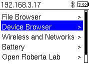
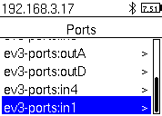
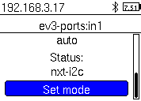

Flashing the LMS-ESP32 board
============================

The latest firmware for this board can be downloaded from here:
`firmware_ESP32_ULAB_LVGL_SPIRAM_<timestamp>.bin <https://github.com/antonvh/UartRemote/tree/master/MicroPython/ESP32>`__.
This is a version that supports the extra SP-RAM and has the latest
UartRemote library integrated in its firmware. Furthermore, the
`ulab <https://github.com/v923z/micropython-ulab.git>`__ and
`LVGL <https://github.com/lvgl/lv_micropython>`__ libraries are also
integrated. The firmware name shows the build timestamp.

Use the flash tool
------------------

Using the integrated USB UART on the ESP32 board, you can easily flash a
new firmware version on the board using the ``flash32.py`` scripts in
this github:
`github.com/antonvh/slah-esp <https://github.com/antonvh/flash-esp>`__.

Flashing the esp-i2c-wifi board
===============================

The boards ship flashed, but you can reflash them with your own
operating system or version of Micropython. There are two options: via a
Mac or PC with a USB FTDI cable or via an EV3 brick and a serial port.
Depending on the hardware you have laying around, choose the best option
for you.

Micropython with integrated UartRemote library
----------------------------------------------

For your convenience we compiled a micropython firmware with the
`UartRemote <https://github.com/antonvh/LMS-uart-esp/tree/main/Libraries/UartRemote>`__
Library compiled as a frozen module. There is no need to upload the
library seperately. The firmware can be found here
`micropython_v1.16_uartremote.bin <https://github.com/antonvh/LMS-uart-esp/blob/main/Libraries/UartRemote/MicroPython/ESP8266>`__

EV3 brick and serial port
-------------------------

Make sure your EV3 brick runs the `latest version
ev3dev <https://ev3dev.org>`__. On that website there are very good
guides for setting up ev3dev and Visual Studio Code. Use these guides to
connect your brick over USB or Bluetooth. Once that is done, open a
terminal to your EV3 in VS Code and get started. Make sure you have
enabled network sharing on your laptop and created a working internet
network connection from the screen of your EV3. You will know that you
have an internet connection if your brick shows a valid IP number in the
top left of the screen. Guides for Mac and PC are on
`ev3dev.org <https://ev3dev.org>`__

1. To open an ssh terminal, right-click your brick in the EV3DEV DEVICE
   BROWSER in VS Code and select 'open ssh terminal' |opening an ssh
   terminal|
2. Download esptool.py and a micropython binary to your home directory
   on the ev3 brick.

::

   curl -O -J https://raw.githubusercontent.com/espressif/esptool/master/esptool.py
   curl -O -J https://micropython.org/resources/firmware/esp8266-20210618-v1.16.bin

3. Enable a serial port. The easiest way to do this is to change the
   port mode via brickman on the screen of your EV3 brick. |device
   browser| |ports| |mode| |other uart|
4. Connect the esp board with the breakt to port 1 of the EV3 brick.
   Make sure GND on the breakout board (top left) is aligned with GND on
   the ESP Board.
5. Put the esp in bootmode by holding the BOOT button while pressing and
   releasing the RESET button
6. Erase the esp flash like this:

::

   python3 esptool.py --port /dev/tty_ev3-ports\:in1  erase_flash

7. Put the ESP in boot mode again, like in step 5. The write the flash
   like this:

::

   python3 esptool.py --port /dev/tty_ev3-ports\:in1 --baud 460800 write_flash --flash_size=detect 0 esp8266-20210618-v1.16.bin

8. Reset the ESP by cycling the power or pressing RESET.
9. Check if you get the ESP MicroPython REPL over UART:

::

   screen /dev/tty_ev3-ports\:in1 115200

10. You should get ``>>>`` if you press enter. Try typing ``1+1`` (and
    enter) to see if the esp can do math! Now might be a good time to
    `configure the WebREPL <Configure-webrepl>`__ for easy access to
    your ESP.

press ctr-a and the k to exit screen.

FTDI Cable and Mac/PC/Linux
---------------------------

Using an FTDI USB serial convertor you can flash the ESP8266 with new
firmware.

|FTDI FT232 module|

The new ESP board has an FTDI compatible 'wobble' connector. This allows
you to insert the FTDI board without soldering the pins because due to
the friction, the pins will make contact.

|ftdi connected to esp|

For the older type of board, you need some jumper wires to connect the
``GND``, ``+3.3V``, ``TX`` and ``RX``. Note that the ``TX`` and ``RX``
pins need to be cross-connected (TX of FTDI to RX of ESP and vice
versa). Also ascertain that the jumper on the FTDI board is placed to
the 3.3V pin, as all logic of the ESP8266 is 3.3V. 5V logic signals will
cause damage to the ESP8266 board!

There is an automated flashing script that does everything here:
`https://github.com/antonvh/flash-esp <https://github.com/antonvh/flash-esp>`__
We also have a
`esp_flash_config.py <https://github.com/antonvh/LMS-uart-esp/tree/main/Libraries/UartRemote/MicroPython/ESP8266#readme>`__
that will help you flash MicroPython to the ESP board and configure
WebREPL and Wifi in MicroPython.

If you want to do it manually, this is what you type in the terminal:

::

   pip3 install pyserial
   curl -O -J https://raw.githubusercontent.com/espressif/esptool/master/esptool.py
   curl -O -J https://micropython.org/resources/firmware/esp8266-20210618-v1.16.bin
   python3 esptool.py --port /dev/cu.usbserial-AH0692NU  erase_flash

Now press reset on the board, while holding the boot button. Note that
you should probably change the /dev/ path in the last line, depending on
your system.

Then go on:

::

   python3 esptool.py --port /dev/cu.usbserial-AH0692NU --baud 460800 write_flash --flash_size=detect 0 esp8266-20210618-v1.16.bin

Press reset again, this time without the boot button pressed. Then go
on:

::

   screen /dev/cu.usbserial-AH0692NU

Hit return until you see >>>. Then: ``import webrepl_setup`` and follow
instructions. Press ctrl-a and then k to quit ``screen``.

.. |opening an ssh terminal| image:: images/open-ssh-terminal.png

.. |other uart| image:: images/other-uart.png
.. |FTDI FT232 module| image:: images/FTDI232.jpeg
.. |ftdi connected to esp| image:: images/ftdi_esp.jpeg
