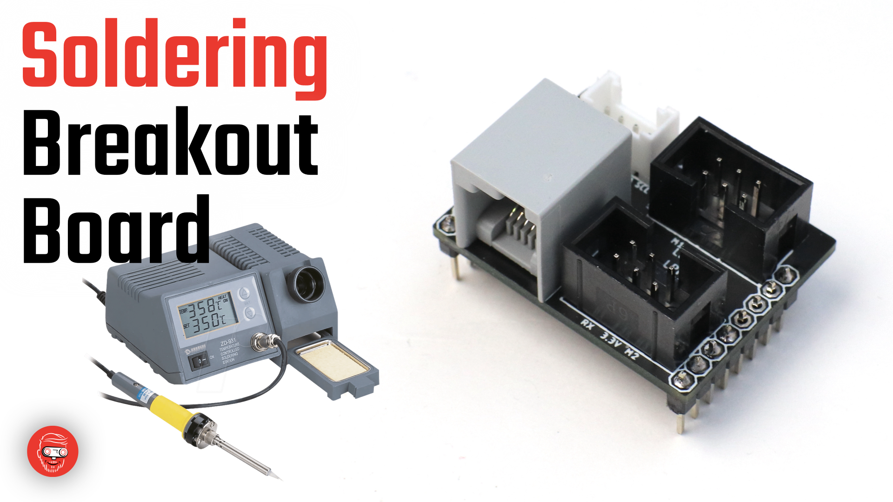
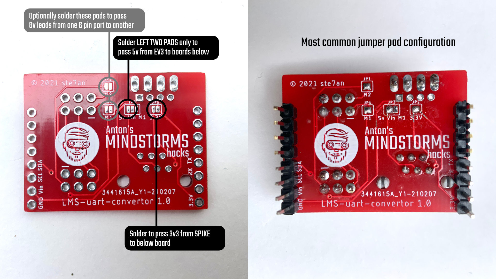
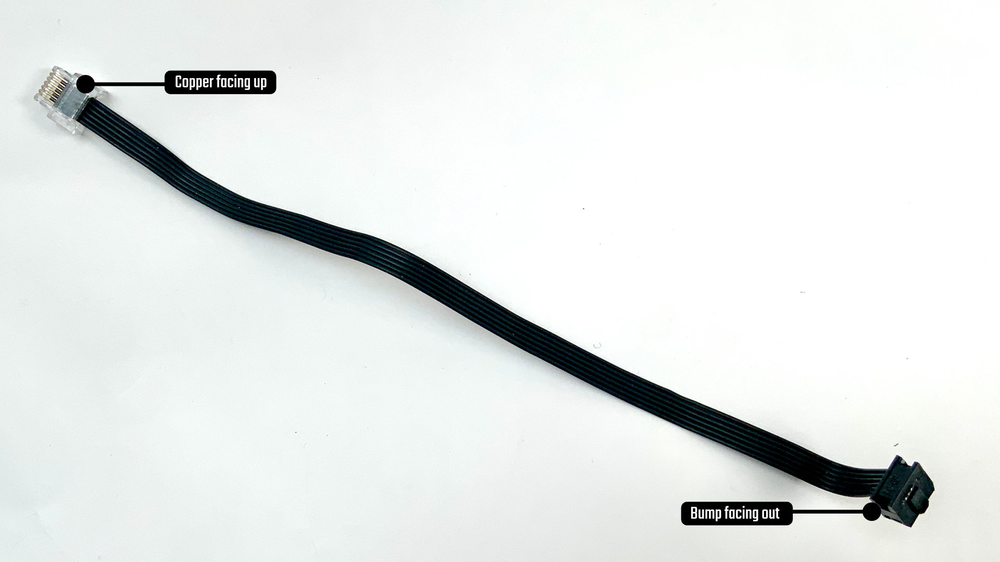

LMS Uart Converter board
========================

Here's the pinout of the convertor board |LMS-uart-convertor pinout|

Mounting the ports and headers
------------------------------

I use leadless souldering tin and soldering station at 330ºC. To
assemble the ports and the headers, I usually fix one of the pins with
some tin on the iron. Then I bend everything in place and solder the
other pads. Finally I come back to the first one.

If you mount the black 6 pin ports, be sure to align the slot with the
white line printed on the board.

The i2c header is optional. You can use an i2c grove port or a 4 pin
header. It will not be connected to any LEGO wire. It exposes i2c pins
from the OpenMV or ESP board below.

|Youtub video of assmbly|

Configuring the soldering pads
------------------------------

Here's how to use the soldering pads: |Soldering pads|

Crimping a Wedo/Power Functions/LPF2 wire
-----------------------------------------

|Cable crimping|

Assembly
--------

with the pins and ports you want. Be sure to connect the 5v to Vin via a
soldering jumper and the 3v3 to Vin in the same way. You can also solder
the M1 and M2 jumpers. But be careful when connecting two SPIKE/Robot
Inventor hubs once you did that. I'm not sure what will happen.

Next put the breakout board on top the ESP board. You can not break
anything if you mount it upside down, but it just won't work. Make sure
the grey NXT port is on the same side as the Wifi chip.

.. |LMS-uart-convertor pinout| image:: https://github.com/antonvh/LMS-uart-esp/wiki/images/LMS-uart-pinout.jpg

